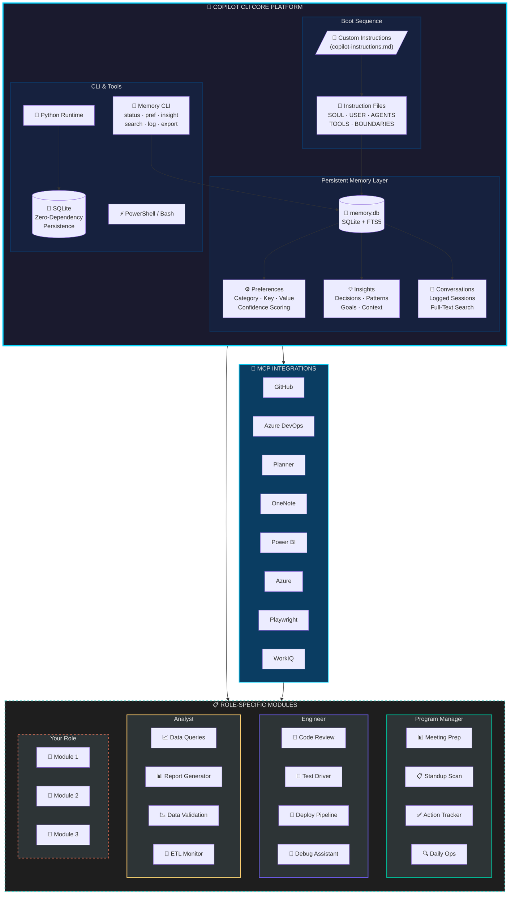
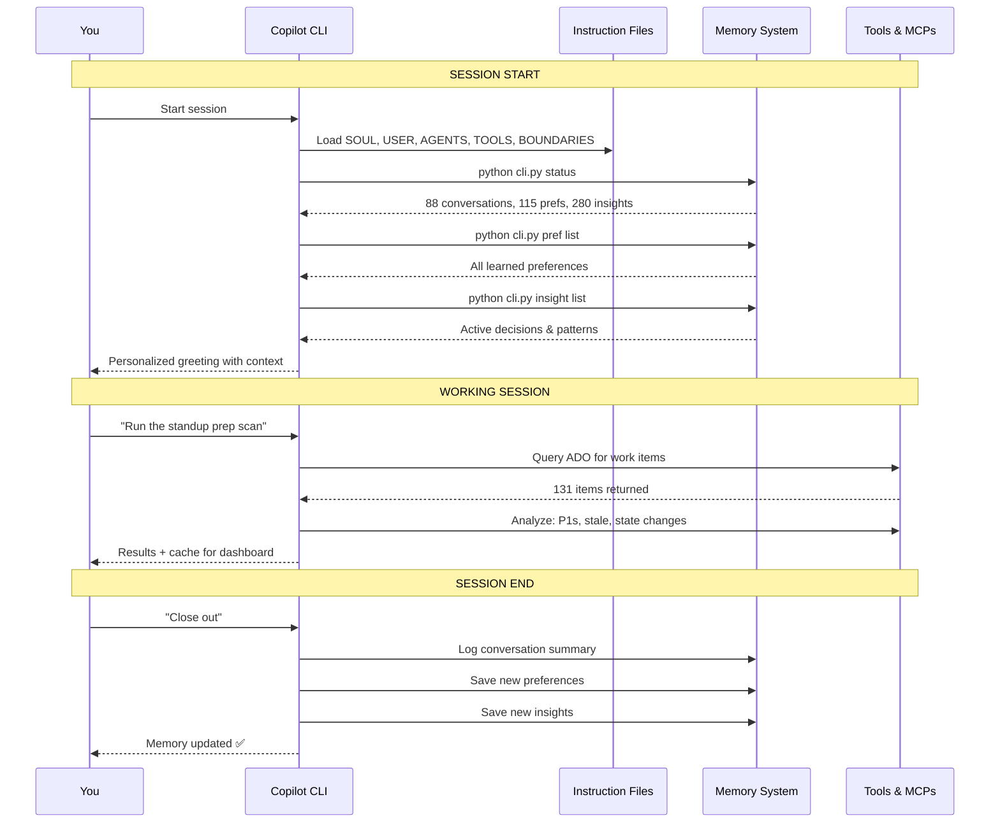

# Architecture

> Visual overview of the Copilot CLI Toolkit — core platform + extensible role modules.

## System Architecture

## How It Fits Together

The **Core Platform** (solid border) is what every user gets — persistent memory, structured instructions, and the CLI tools to tie it all together. This is Tier 1 and Tier 2 of the toolkit.

**MCP Integrations** plug into the core to give your assistant access to external systems. Pick the ones relevant to your work.

**Role-Specific Modules** (dashed border) are where it gets personal. The PM module is battle-tested. Engineer, Analyst, and custom roles are templates showing how to extend the platform for any workflow.

## Data Flow

## Tier Map

```mermaid
graph LR
    subgraph T1["🟢 Tier 1: Start Here"]
        A1["Custom Instructions"]
        A2["Quick Start Guide"]
    end
    
    subgraph T2["🔵 Tier 2: Foundation"]
        B1["Memory System"]
        B2["Instruction Files"]
        B3["Memory Guide"]
    end
    
    subgraph T3["🟡 Tier 3: Workflows"]
        C1["Meeting Prep"]
        C2["Standup Scan"]
        C3["Action Tracker"]
        C4["Daily Ops"]
    end
    
    subgraph T4["🔴 Tier 4: Advanced"]
        D1["Agent Engine"]
        D2["Ops Dashboard"]
        D3["MCP Configs"]
    end

    T1 --> T2 --> T3 --> T4

    style T1 fill:#00b894,stroke:#00b894,color:#fff
    style T2 fill:#0984e3,stroke:#0984e3,color:#fff
    style T3 fill:#fdcb6e,stroke:#fdcb6e,color:#333
    style T4 fill:#d63031,stroke:#d63031,color:#fff
```

